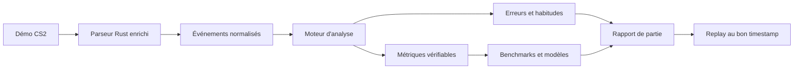

# RoundLab

RoundLab est une application web d'analyse de démos Counter-Strike 2. Elle
importe des fichiers GOTV, les analyse localement dans le navigateur et permet
de rejouer chaque round sur un radar 2D interactif.

**Application publique :** [lakav.github.io/RoundLab](https://lakav.github.io/RoundLab/)

> RoundLab est actuellement un lecteur de replay avancé. La prochaine grande
> évolution prévue est la construction d'un véritable rapport de partie avec
> des analyses détaillées pour chaque joueur. Cette roadmap est décrite dans ce
> document, mais elle n'est pas encore implémentée.

## Sommaire

- [Principes du projet](#principes-du-projet)
- [État actuel](#état-actuel)
- [Limites actuelles](#limites-actuelles)
- [Vision produit](#vision-produit)
- [Architecture analytique cible](#architecture-analytique-cible)
- [Domaines d'analyse prévus](#domaines-danalyse-prévus)
- [Faisabilité selon les données](#faisabilité-selon-les-données)
- [Roadmap](#roadmap)
- [Première version analytique recommandée](#première-version-analytique-recommandée)
- [Structure du dépôt](#structure-du-dépôt)
- [Développement et validation](#développement-local)
- [Déploiement](#déploiement)

## Principes du projet

- **Traitement local :** aucune démo n'est envoyée vers un serveur.
- **Résultats explicables :** une statistique doit indiquer comment elle est
  calculée et permettre de retrouver les actions qui la justifient.
- **Replay comme preuve :** les futures analyses devront ouvrir directement le
  replay au round et au timestamp concernés.
- **Fiabilité avant quantité :** aucune note globale ne doit être affichée sans
  données suffisantes, formule documentée et validation sérieuse.
- **Séparation des responsabilités :** le parseur extrait les faits, le moteur
  d'analyse calcule les métriques et l'interface les présente.

## État actuel

RoundLab sait aujourd'hui :

- importer des fichiers `.dem` et `.dem.zst` ;
- parser les démos localement avec le parseur Rust compilé en WebAssembly ;
- conserver les matchs et les rounds dans IndexedDB ;
- rejouer un round sur le radar de la map ;
- afficher les joueurs, leur orientation, leur équipement et leur état ;
- afficher la bombe, les poses, les désamorçages et l'explosion ;
- afficher les tirs, trajectoires et effets des grenades ;
- afficher le killfeed et ses modificateurs ;
- parcourir la timeline, changer la vitesse et passer d'un round à l'autre ;
- dessiner des annotations sur la map ;
- superposer plusieurs rounds d'un même joueur avec le mode condensé ;
- fonctionner comme un site statique déployé sur GitHub Pages.

Le replay interactif constitue la première grande fonctionnalité du produit.
Il doit rester stable pendant la construction de la partie analytique.

## Limites actuelles

RoundLab ne fournit pas encore :

- de rapport statistique complet de la partie ;
- de fiche analytique par joueur ;
- d'ADR fiable ni de détail complet des dégâts ;
- d'analyse précise de l'aim, du spray ou du counter-strafe ;
- d'analyse des lignes de vue et du placement du viseur ;
- de score de positionnement ;
- de benchmarks par niveau ;
- de suivi de progression sur plusieurs matchs ;
- de recommandations d'entraînement automatiques.

Le schéma de replay actuel contient déjà les positions, orientations
horizontales, inventaires, économies, kills, actions de bombe, tirs et
projectiles. Il ne contient pas encore toutes les données nécessaires aux
analyses les plus avancées : pitch, impacts de balles, dégâts détaillés,
hitgroups, états de mouvement précis, crouch et visibilité réelle entre les
joueurs.

## Vision produit

La cible est une interface d'analyse post-match approfondie, inspirée par les
meilleures plateformes d'analyse CS2, mais centrée sur trois niveaux de lecture :

1. **Résumé :** comprendre rapidement la partie, les forces et les faiblesses.
2. **Détail :** explorer les métriques par équipe, joueur, côté et round.
3. **Preuve :** ouvrir le replay exactement au moment qui explique le résultat.

RoundLab ne doit pas devenir un tableau rempli de scores opaques. Une analyse
doit rester vérifiable, contextualisée et exploitable par un joueur ou un coach.

## Architecture analytique cible



Le pipeline devra rester versionné : une évolution de formule ou de schéma ne
doit pas modifier silencieusement les anciennes analyses.

## Domaines d'analyse prévus

### Impact et combat

- kills, morts, assists, K/D et KAST ;
- dégâts, ADR et dégâts d'armure ;
- headshots et hitgroups ;
- openings tentés, gagnés et perdus ;
- multikills et séries de kills ;
- impact d'un kill selon l'économie et la situation numérique ;
- conversions et pertes d'avantage ;
- performance CT/T, par arme et par type d'achat ;
- morts évitables et équipement perdu.

### Aim et mécanique

- précision globale et par arme ;
- précision du premier tir ;
- placement du viseur ;
- temps entre la première visibilité et le premier dégât ;
- vitesse au moment du tir ;
- qualité du counter-strafe ;
- taps, bursts et sprays ;
- contrôle et précision des sprays ;
- tirs nécessaires pour obtenir un kill ;
- duels où le joueur tire ou touche en premier ;
- performance spécifique à l'AWP.

### Trading et jeu collectif

- opportunités, tentatives et réussites de trade ;
- temps nécessaire pour effectuer le trade ;
- morts tradeables ou non ;
- spacing entre coéquipiers ;
- joueurs trop isolés ;
- doubles peeks ;
- flash assists et contributions indirectes ;
- comportement collectif en avantage numérique.

### Utilitaires

- grenades utilisées par round ;
- utilitaires conservés à la mort ;
- dégâts par HE et par molotov ;
- ennemis et coéquipiers flashés ;
- durée de blindage ;
- flashs menant à un kill ;
- smokes qui bloquent réellement une attaque ;
- utilitaires trop tardifs, redondants ou sans impact ;
- timings et régularité des lineups ;
- séparation entre quantité utilisée et qualité obtenue.

### Positionnement et décisions

- zones occupées et routes utilisées ;
- timings d'arrivée ;
- exposition à plusieurs angles ;
- distance avec les coéquipiers ;
- rotations précoces ou tardives ;
- positions tradeables ;
- comportement en avantage et désavantage ;
- qualité des post-plants, retakes et sauvegardes ;
- zones où le joueur gagne ou perd ses duels ;
- répétition de positions ou de routes prévisibles ;
- heatmaps séparées pour les côtés T et CT.

### Économie

- valeur de l'équipement au début du round ;
- achats désynchronisés de l'équipe ;
- utilitaires oubliés ;
- pertes économiques ;
- armes sauvegardées ;
- performance contre éco, force-buy et full-buy ;
- impact d'une mort sur le round suivant.

### Clutches et situations décisives

- opportunités de clutch ;
- résultats en 1v1, 1v2, 1v3 et plus ;
- post-plants et retakes ;
- contexte de temps, bombe et information ;
- probabilité de victoire avant et après les événements importants.

### Progression sur plusieurs parties

- tendances sur les derniers matchs ;
- évolution par map, côté, arme et rôle ;
- erreurs récurrentes ;
- zones faibles ;
- habitudes d'utilitaires ;
- comparaison du joueur avec ses propres performances passées ;
- objectifs d'entraînement mesurables.

## Faisabilité selon les données

| Niveau | Analyses concernées |
| --- | --- |
| Déjà largement calculables | K/D, headshots, openings, multikills, survie, situations de clutch, trades temporels, économie approximative, grenades lancées, routes et rotations simples |
| Parseur à enrichir | ADR fiable, dégâts par arme et utilitaire, hitgroups, impacts de balles, spray accuracy, crouch, vitesse exacte, pitch et événements de flash détaillés |
| Géométrie des maps nécessaire | Visibilité réelle, placement du viseur, temps de réaction, angles exposés, contrôle des zones et positionnement avancé |
| Corpus de parties nécessaire | Percentiles, benchmarks par niveau, probabilité de victoire, scores globaux et comparaisons fiables |

Un score `78/100` calculé sans corpus ni benchmark serait trompeur. Les premières
versions du rapport devront donc afficher des faits et des métriques brutes
avant de chercher à produire une note RoundLab.

## Roadmap

Cette roadmap décrit l'ordre prévu. Elle ne constitue pas un engagement de
date et ne signifie pas que les étapes sont déjà en développement.

### Étape 0 — Spécification des métriques

- définir le public principal : joueur individuel, équipe ou coach ;
- créer un dictionnaire des métriques ;
- documenter chaque formule ;
- lister les données nécessaires et les cas exclus ;
- distinguer faits, heuristiques, benchmarks et modèles ;
- définir le lien entre une métrique et ses preuves dans le replay.

**Critère de sortie :** une même entrée produit le même résultat pour toute
implémentation respectant la spécification.

### Étape 1 — Stabilisation de l'architecture

- découper progressivement le renderer principal ;
- séparer joueurs, projectiles, effets, bombe et cycle Pixi ;
- isoler les calculs de replay hors des composants React ;
- versionner le format des matchs et des analyses ;
- prévoir les migrations IndexedDB ;
- maintenir les démos de référence et les tests visuels.

**Critère de sortie :** ajouter une métrique ne nécessite aucune modification du
moteur d'affichage du replay.

### Étape 2 — Enrichissement du parseur

- ajouter les événements complets de dégâts ;
- conserver dégâts de vie, dégâts d'armure, arme et hitgroup ;
- extraire les impacts de balles ;
- ajouter pitch, vitesse et états de mouvement ;
- améliorer les informations de flash ;
- conserver achats et valeurs d'équipement ;
- valider chaque champ sur les démos de référence.

**Critère de sortie :** les statistiques de combat et d'utilitaires peuvent être
recalculées sans déductions fragiles depuis les seules variations de HP.

### Étape 3 — Moteur d'analyse V1

- produire un `MatchAnalysis` indépendant de l'interface ;
- calculer les statistiques par match, équipe, joueur et round ;
- détecter openings, multikills, clutches et trades ;
- calculer survie, économie et utilisation des grenades ;
- conserver les rounds et timestamps servant de preuves ;
- ajouter des tests déterministes pour chaque formule.

**Critère de sortie :** un rapport JSON stable peut être produit sans lancer
l'interface.

### Étape 4 — Rapport de partie V1

Créer une nouvelle interface organisée autour de :

- Vue d'ensemble ;
- Joueurs ;
- Rounds ;
- Aim ;
- Utilitaires ;
- Trading ;
- Positionnement ;
- Économie ;
- Replay.

Chaque fiche joueur devra proposer :

1. un résumé avec les métriques importantes ;
2. un détail avec tableaux et graphiques ;
3. les actions justificatives ouvrables dans le replay.

**Critère de sortie :** un utilisateur comprend la performance d'un joueur sans
être confronté à un mur de statistiques.

### Étape 5 — Analyse mécanique avancée

- construire la détection des engagements ;
- déterminer la première visibilité entre deux joueurs ;
- associer tirs, impacts et dégâts ;
- mesurer le placement du viseur ;
- mesurer mouvement et counter-strafe ;
- identifier taps, bursts et sprays ;
- analyser chaque duel avec son contexte.

**Critère de sortie :** chaque mesure d'aim peut être vérifiée sur une action
rejouable.

### Étape 6 — Utilitaires et positionnement avancés

- découper les maps en zones tactiques ;
- intégrer la géométrie et les lignes de vue ;
- analyser les prises de zone et rotations ;
- mesurer spacing et tradeability ;
- évaluer l'impact réel des smokes et molotovs ;
- comparer les trajectoires entre rounds similaires ;
- détecter les habitudes répétitives.

**Critère de sortie :** les analyses dépassent les simples comptes d'événements
et prennent en compte le contexte spatial.

### Étape 7 — Benchmarks et scores

- constituer un corpus de parties suffisamment large ;
- séparer les distributions par niveau, map et côté ;
- calculer médianes, percentiles et intervalles de confiance ;
- construire un modèle de probabilité de victoire ;
- versionner et documenter les modèles ;
- expliquer pourquoi un joueur gagne ou perd des points.

**Critère de sortie :** les scores sont statistiquement défendables et restent
compréhensibles pour l'utilisateur.

### Étape 8 — Historique et recommandations

- agréger plusieurs parties d'un même joueur ;
- détecter tendances et régressions ;
- identifier les erreurs récurrentes ;
- générer des objectifs mesurables ;
- utiliser éventuellement une IA pour résumer les constats déjà calculés.

L'IA ne devra pas inventer l'analyse. Elle pourra expliquer des preuves et des
métriques produites par le moteur déterministe.

## Première version analytique recommandée

La première version utile du rapport devrait rester limitée à environ quinze
métriques fiables :

- K/D/A ;
- headshot rate ;
- ADR après enrichissement du parseur ;
- KAST ;
- openings gagnés et perdus ;
- multikills ;
- clutches ;
- trades réussis ;
- morts tradées ;
- survie ;
- grenades utilisées ;
- flash assists ;
- utilitaires conservés à la mort ;
- performance CT/T ;
- moments importants reliés au replay.

Cette base doit être validée avant l'ajout d'un score global ou d'analyses de
positionnement complexes.

## Ce que le projet doit éviter

- copier les formules, le nom ou l'identité visuelle d'une autre plateforme ;
- inventer immédiatement un score RoundLab ;
- mélanger les calculs d'analyse avec React ou Pixi ;
- afficher une recommandation sans preuve ;
- utiliser une IA comme source de vérité ;
- commencer par le positionnement avancé avant de fiabiliser les dégâts ;
- comparer un joueur à des professionnels sans benchmark adapté ;
- casser le replay existant pendant la transformation.

## Structure du dépôt

```text
desktop/         Application web Next.js, interface et moteur de replay
parser/          Parseur Rust et point d'entrée WebAssembly
vendor/          Dépendances du parseur conservées dans le dépôt
ressources/      Ressources graphiques sources
scripts/         Audits, validations et outils de développement
docs/            Notes techniques et données de référence
```

Le parseur Rust est le seul parseur produit. L'ancien travail de comparaison
avec le parseur Go est conservé uniquement comme documentation historique dans
[`docs/parser-go-rust-comparison.md`](docs/parser-go-rust-comparison.md).

## Développement local

Prérequis :

- Node.js 24 ;
- pnpm 11 ;
- Rust stable ;
- la cible `wasm32-unknown-unknown` ;
- `wasm-bindgen-cli` pour reconstruire le parseur navigateur.

```bash
cd desktop
pnpm install
pnpm dev
```

L'application est ensuite disponible sur `http://localhost:3000`.

Après une modification du parseur Rust :

```bash
cd desktop
pnpm parser:wasm
```

## Validation

Vérifications principales de l'interface :

```bash
cd desktop
pnpm lint
pnpm exec tsc --noEmit
pnpm test:coverage
pnpm build
pnpm test:e2e
```

Vérifications principales du parseur :

```bash
cd parser
cargo test
cargo check --target wasm32-unknown-unknown --lib
```

La suite locale complète peut être lancée avec :

```bash
python3 scripts/run-local-ci-checks.py
```

Les démos réelles restent hors du dépôt. Elles peuvent être utilisées par les
tests d'intégrité et de performance grâce aux variables
`ROUNDLAB_TEST_DEMOS` et `ROUNDLAB_BENCHMARK_DEMOS`.

Les références et invariants du parseur sont décrits dans
[`docs/parser-rust-only.md`](docs/parser-rust-only.md) et
[`parser/reference_demos.json`](parser/reference_demos.json).

## Navigateurs

Le parseur local nécessite Web Workers, WebAssembly, IndexedDB, la File API et
`crypto.randomUUID`.

- Chrome : validé avec de vraies démos et des fichiers volumineux ;
- Safari : pas encore validé ;
- Firefox : pas encore validé ;
- Edge : pas encore validé.

La compatibilité multi-navigateur fait partie du travail de stabilisation à
effectuer avant de considérer RoundLab comme un produit finalisé.

## Déploiement

La branche `main` est validée par la CI GitHub. Après réussite des contrôles, le
workflow GitHub Pages construit et publie automatiquement l'application sur
[lakav.github.io/RoundLab](https://lakav.github.io/RoundLab/).

## Prochaine action quand la roadmap reprendra

La prochaine étape ne sera pas de créer immédiatement un dashboard. Elle sera
de rédiger la spécification versionnée des métriques, puis d'ajouter les
événements de dégâts au parseur. Le premier rapport de partie sera construit
seulement lorsque ces données seront fiables et couvertes par des tests.
