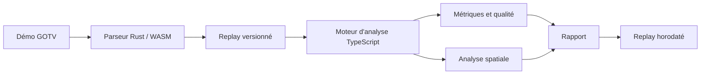

# RoundLab

RoundLab est une application web d'analyse de démos Counter-Strike 2. Elle
importe les fichiers GOTV directement dans le navigateur, calcule des
statistiques vérifiables et permet de rejouer chaque round sur un radar 2D.

**Application publique :** [lakav.github.io/RoundLab](https://lakav.github.io/RoundLab/)

> RoundLab est en bêta. Les métriques disponibles sont déterministes, mais les
> analyses qui exigent une géométrie 3D complète ou un corpus de référence
> restent volontairement limitées ou indisponibles.

## Principes

- **Traitement local :** les démos ne sont pas envoyées vers un serveur.
- **Résultats explicables :** les statistiques exposent leur formule, leur
  couverture et, lorsque c'est possible, les actions qui les justifient.
- **Replay libre :** RoundLab fournit des faits et des raccourcis horodatés,
  sans sélectionner automatiquement les « moments importants ».
- **Fiabilité avant quantité :** une donnée absente ne devient pas un faux
  zéro et aucun score global n'est publié sans benchmark suffisant.
- **Responsabilités séparées :** le parseur extrait les faits, le moteur
  d'analyse calcule les métriques et l'interface les présente.

## Fonctionnalités actuelles

### Import et stockage

- import local des fichiers `.dem` et `.dem.zst` ;
- parseur Rust compilé en WebAssembly et exécuté dans un Web Worker ;
- stockage des matchs et des rounds dans IndexedDB ;
- coexistence des anciens imports avec le schéma actuel
  [`roundlab.replay.v2`](docs/replay-schema-v2.md).

### Replay

- radar 2D pour les dix maps calibrées : Ancient, Anubis, Cache, Dust2,
  Inferno, Mirage, Nuke, Overpass, Train et Vertigo ;
- joueurs, orientation, équipement, tirs, killfeed et état de la bombe ;
- trajectoires et effets des grenades ;
- navigation par round, timeline, vitesse de lecture et annotations ;
- superposition des trajectoires d'un joueur sur plusieurs rounds ;
- prise en charge des radars à plusieurs niveaux pour Nuke, Train et Vertigo.

### Rapport statistique

- K/D/A, ADR, KAST, headshots, openings, multikills, clutches et trades ;
- économie, valeurs d'équipement et performance par type d'achat ;
- tirs, taps, bursts, sprays, mouvement au tir et counter-strafe ;
- utilitaires lancés, dégâts, flash assists et inventaire conservé à la mort ;
- zones visitées, transitions, rotations, spacing et tradeability ;
- actions factuelles ouvrables au bon round et au bon timestamp ;
- sélection d'un joueur conservée entre toutes les sections du rapport ;
- comparaison de deux joueurs quelconques du match, y compris deux
  coéquipiers ;
- callouts adaptés à chaque map, avec des libellés composites lorsque le
  découpage ne permet pas une précision plus fine.

## Limites connues

RoundLab ne fournit pas encore :

- de géométrie 3D Valve distribuée avec le projet ;
- de visibilité parfaite lorsque portes, props ou obstacles dynamiques sont
  impliqués ;
- de benchmarks assez larges pour publier des percentiles fiables par niveau,
  map et côté ;
- de rating global Aim, Positioning ou Utility statistiquement calibré ;
- d'interface complète pour l'historique multi-matchs ;
- de validation complète sous Safari et Firefox.

Les métriques dépendantes d'un flux absent, comme certains impacts ou états de
géométrie, restent marquées indisponibles. RoundLab ne reconstruit pas ces
données en les inventant.

### Réimporter un ancien match

Les imports historiques restent intacts. Pour obtenir les métriques du schéma
actuel, réimporte la démo GOTV originale en mode **Précision maximale**. Le
nouvel import est créé à côté de l'ancien ; aucun match n'est écrasé
automatiquement.

## Architecture



Le parseur Rust est l'unique parseur utilisé par le produit. Les anciennes
comparaisons avec d'autres parseurs sont conservées uniquement comme outils de
validation et documentation historique.

## Structure du dépôt

```text
web/       Application Next.js, interface, replay et moteur d'analyse
parser/    Parseur Rust et point d'entrée WebAssembly
scripts/   Audits, validations et outils de développement
docs/      Spécifications techniques et données de référence
vendor/    Dépendance du parseur conservée dans le dépôt
```

## Développement local

### Prérequis

- Node.js 24 ;
- pnpm 11 ;
- Rust 1.95 avec `wasm32-unknown-unknown` ;
- `wasm-bindgen-cli` pour reconstruire le parseur navigateur.

### Lancer l'application

```bash
cd web
pnpm install
pnpm dev
```

L'application est disponible sur [localhost:3000](http://localhost:3000/).
Les artefacts WASM nécessaires au démarrage sont versionnés dans le dépôt.

### Reconstruire le parseur WASM

Après une modification du parseur Rust :

```bash
cd web
pnpm parser:wasm
```

Cette commande reconstruit le parseur puis régénère
`web/src/wasm/roundlab_parser`.

## Validation

Contrôles web principaux :

```bash
cd web
pnpm audit --audit-level high
pnpm lint
pnpm exec tsc --noEmit
pnpm test:coverage
pnpm build
pnpm test:e2e:a11y
```

Contrôles du parseur :

```bash
cd parser
cargo fmt --check
cargo test
cargo clippy --all-targets -- -D warnings
cargo check --target wasm32-unknown-unknown --lib
```

Les contrôles web et les audits portables utilisés par la CI peuvent être
lancés depuis la racine :

```bash
python3 scripts/run-local-ci-checks.py
```

Les démos réelles restent hors du dépôt. Les tests et benchmarks qui en ont
besoin utilisent `ROUNDLAB_TEST_DEMOS` et `ROUNDLAB_BENCHMARK_DEMOS`.

## Documentation technique

| Sujet | Document |
| --- | --- |
| Schéma de replay | [`docs/replay-schema-v2.md`](docs/replay-schema-v2.md) |
| Métriques principales | [`docs/analytics-metrics-v1.md`](docs/analytics-metrics-v1.md) |
| Analyse mécanique | [`docs/mechanics-analysis-v2.md`](docs/mechanics-analysis-v2.md) |
| Analyse spatiale | [`docs/spatial-analysis-v1.md`](docs/spatial-analysis-v1.md) |
| Import de géométrie | [`docs/map-geometry-import.md`](docs/map-geometry-import.md) |
| Historique joueur | [`docs/player-history-v1.md`](docs/player-history-v1.md) |
| Corpus de benchmark | [`docs/benchmark-corpus-v1.md`](docs/benchmark-corpus-v1.md) |
| Collecte des benchmarks | [`docs/benchmark-collection-v1.md`](docs/benchmark-collection-v1.md) |
| Invariants du parseur | [`docs/parser-rust-only.md`](docs/parser-rust-only.md) |
| Snapshots de référence | [`parser/reference-demos.json`](parser/reference-demos.json) |

## Navigateurs

Le parseur local nécessite Web Workers, WebAssembly, IndexedDB, la File API et
`crypto.randomUUID`.

- Chrome : validé avec de vraies démos et des fichiers volumineux ;
- Edge : basé sur Chromium, mais pas validé séparément ;
- Safari : pas encore validé ;
- Firefox : pas encore validé.

## Déploiement

RoundLab est exporté comme site statique. Chaque changement envoyé sur `main`
est contrôlé par GitHub Actions ; après réussite de la CI, GitHub Pages construit
et publie automatiquement `web/out`, conformément à la
[`configuration Next.js`](web/next.config.ts), sur
[lakav.github.io/RoundLab](https://lakav.github.io/RoundLab/).

## Priorités actuelles

1. généraliser les indicateurs de couverture et d'indisponibilité ;
2. valider les métriques dépendantes de la géométrie sur des assets locaux
   autorisés ;
3. construire une interface d'historique statistique multi-matchs ;
4. constituer un corpus consenti, versionné et audité avant tout percentile ou
   rating RoundLab.
