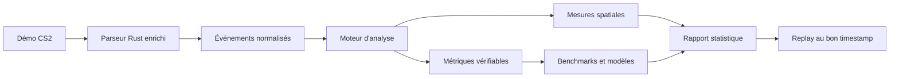

# RoundLab

RoundLab est une application web d'analyse de démos Counter-Strike 2. Elle
importe des fichiers GOTV, les analyse localement dans le navigateur et permet
de rejouer chaque round sur un radar 2D interactif.

**Application publique :** [lakav.github.io/RoundLab](https://lakav.github.io/RoundLab/)

> RoundLab possède un replay avancé et un moteur de statistiques déterministe
> couvrant le combat, l'aim, les utilitaires, l'économie et les données
> spatiales. Le produit ne sélectionne plus automatiquement de « moments clés »
> et ne formule plus de Review tactique : le joueur explore lui-même le replay.

## Sommaire

- [Principes du projet](#principes-du-projet)
- [État actuel](#état-actuel)
- [Limites actuelles](#limites-actuelles)
- [Vision produit](#vision-produit)
- [Expérience statistique cible](#expérience-statistique-cible)
- [Architecture analytique cible](#architecture-analytique-cible)
- [Domaines d'analyse prévus](#domaines-danalyse-prévus)
- [Faisabilité selon les données](#faisabilité-selon-les-données)
- [Roadmap](#roadmap)
- [Première version analytique recommandée](#première-version-analytique-recommandée)
- [Structure du dépôt](#structure-du-dépôt)
- [Développement et validation](#développement-local)
- [Déploiement](#déploiement)

## Principes du projet

- **Traitement local :** aucune démo n'est envoyée vers un serveur.
- **Résultats explicables :** une statistique doit indiquer comment elle est
  calculée et permettre de retrouver les actions qui la justifient.
- **Replay libre :** les actions factuelles peuvent ouvrir le bon round, mais
  RoundLab ne choisit pas automatiquement les séquences importantes.
- **Fiabilité avant quantité :** aucune note globale ne doit être affichée sans
  données suffisantes, formule documentée et validation sérieuse.
- **Séparation des responsabilités :** le parseur extrait les faits, le moteur
  d'analyse calcule les métriques et l'interface les présente.

## État actuel

RoundLab sait aujourd'hui :

- importer des fichiers `.dem` et `.dem.zst` ;
- parser les démos localement avec le parseur Rust compilé en WebAssembly ;
- conserver les matchs et les rounds dans IndexedDB ;
- rejouer un round sur le radar de la map ;
- afficher les joueurs, leur orientation, leur équipement et leur état ;
- afficher la bombe, les poses, les désamorçages et l'explosion ;
- afficher les tirs, trajectoires et effets des grenades ;
- afficher le killfeed et ses modificateurs ;
- parcourir la timeline, changer la vitesse et passer d'un round à l'autre ;
- dessiner des annotations sur la map ;
- superposer plusieurs rounds d'un même joueur avec le mode condensé ;
- produire un rapport avec K/D/A, ADR, KAST, openings, clutches, trades,
  économie et utilitaires ;
- analyser les tirs, sprays, mouvements au tir, duels et placements initiaux
  du viseur lorsque les données nécessaires existent ;
- mesurer zones visitées, transitions, rotations, spacing, tradeability,
  contrôle de zone et habitudes de trajectoire ;
- relier les actions principales à un round et un timestamp du replay ;
- fonctionner comme un site statique déployé sur GitHub Pages.

Le rapport se concentre sur les valeurs mesurées. Le replay, les trajectoires
et les actions horodatées restent disponibles pour une analyse manuelle.

## Limites actuelles

RoundLab ne fournit pas encore :

- de maillages réels validés pour toutes les maps, nécessaires aux lignes de
  vue et mesures de visibilité les plus fiables ;
- de benchmarks suffisamment alimentés pour publier des percentiles par
  niveau, map et côté ;
- de scores Aim, Positioning ou Utility Quality statistiquement calibrés ;
- d'interface complète pour l'historique statistique multi-matchs.

Le schéma de replay contient les positions, yaw et pitch lorsqu'ils sont
disponibles, états de mouvement, inventaires, économies, kills, dégâts,
hitgroups, tirs, impacts, flashes et projectiles. Les limites restantes viennent
surtout de la géométrie réelle des maps, des données parfois absentes dans les
démos et du manque de corpus de référence.

Le format produit par le parseur est versionné
[`roundlab.replay.v2`](docs/replay-schema-v2.md). Les Steam IDs y sont des
chaînes afin de rester exacts dans les navigateurs.

## Vision produit

La cible est une interface statistique post-match approfondie, inspirée par les
meilleures plateformes d'analyse CS2, mais centrée sur trois niveaux de lecture :

1. **Résumé :** lire immédiatement le score et les métriques principales.
2. **Détail :** explorer les valeurs par équipe, joueur, côté et round.
3. **Replay :** vérifier manuellement les actions horodatées si nécessaire.

RoundLab ne doit ni inventer de conclusion tactique, ni classer arbitrairement
les actions d'un joueur. Une statistique doit rester calculable, documentée et
vérifiable.

## Expérience statistique cible

Le rapport est organisé autour de trois vues stables :

1. **Résumé :** résultat et tableau statistique configurable.
2. **Joueurs :** métriques regroupées par combat, aim, utilitaires et jeu
   collectif.
3. **Rounds :** déroulé chronologique, économie et contributions par round.

Le replay libre et les trajectoires restent séparés du rapport. Les lignes
d'actions (kills, trades, utilitaires, openings) peuvent servir de raccourcis
vers leur timestamp, sans être présentées comme des moments importants.

### Présentation de la bêta

L'accueil présente explicitement RoundLab comme une bêta régulièrement
modifiée. Il indique que la bêta est entièrement gratuite et que la version
finale stable sera payante. La route statique `/feedback` prépare un rapport de
bug structuré, permet de le copier et ouvre une issue GitHub préremplie. Le
rapport utilise des définitions contextuelles accessibles au survol et au
clavier pour les termes statistiques ou techniques.

Le rapport partage désormais un système visuel unique : bandeau de match avec
radar en arrière-plan, navigation principale et secondaire cohérente, cartes de
métriques homogènes, tableaux denses avec identité d'équipe et première colonne
fixe, et états de focus conformes à la navigation clavier.

## Architecture analytique cible



Le pipeline devra rester versionné : une évolution de formule ou de schéma ne
doit pas modifier silencieusement les anciennes analyses.

## Domaines d'analyse prévus

### Impact et combat

- kills, morts, assists, K/D et KAST ;
- dégâts, ADR et dégâts d'armure ;
- headshots et hitgroups ;
- openings tentés, gagnés et perdus ;
- multikills et séries de kills ;
- impact d'un kill selon l'économie et la situation numérique ;
- conversions et pertes d'avantage ;
- performance CT/T, par arme et par type d'achat ;
- morts évitables et équipement perdu.

### Aim et mécanique

- précision globale et par arme ;
- précision du premier tir ;
- placement du viseur ;
- temps entre la première visibilité et le premier dégât ;
- vitesse au moment du tir ;
- qualité du counter-strafe ;
- taps, bursts et sprays ;
- contrôle et précision des sprays ;
- tirs nécessaires pour obtenir un kill ;
- duels où le joueur tire ou touche en premier ;
- performance spécifique à l'AWP.

### Trading et jeu collectif

- opportunités, tentatives et réussites de trade ;
- temps nécessaire pour effectuer le trade ;
- morts tradeables ou non ;
- spacing entre coéquipiers ;
- joueurs trop isolés ;
- doubles peeks ;
- flash assists et contributions indirectes ;
- comportement collectif en avantage numérique.

### Utilitaires

- grenades utilisées par round ;
- utilitaires conservés à la mort ;
- dégâts par HE et par molotov ;
- ennemis et coéquipiers flashés ;
- durée de blindage ;
- flashs menant à un kill ;
- smokes qui bloquent réellement une attaque ;
- utilitaires trop tardifs, redondants ou sans impact ;
- timings et régularité des lineups ;
- séparation entre quantité utilisée et qualité obtenue.

### Positionnement et décisions

- zones occupées et routes utilisées ;
- timings d'arrivée ;
- exposition à plusieurs angles ;
- distance avec les coéquipiers ;
- rotations précoces ou tardives ;
- positions tradeables ;
- comportement en avantage et désavantage ;
- qualité des post-plants, retakes et sauvegardes ;
- zones où le joueur gagne ou perd ses duels ;
- répétition de positions ou de routes prévisibles ;
- heatmaps séparées pour les côtés T et CT.

### Économie

- valeur de l'équipement au début du round ;
- achats désynchronisés de l'équipe ;
- utilitaires oubliés ;
- pertes économiques ;
- armes sauvegardées ;
- performance contre éco, force-buy et full-buy ;
- impact d'une mort sur le round suivant.

### Clutches et situations décisives

- opportunités de clutch ;
- résultats en 1v1, 1v2, 1v3 et plus ;
- post-plants et retakes ;
- contexte de temps, bombe et information ;
- probabilité de victoire avant et après les événements importants.

### Progression sur plusieurs parties

- tendances sur les derniers matchs ;
- évolution par map, côté, arme et rôle ;
- comparaison du joueur avec ses propres performances passées ;
- médianes, dispersions, tailles d'échantillon et couverture ;
- aucune recommandation ou objectif généré automatiquement.

## Faisabilité selon les données

| Niveau | Analyses concernées |
| --- | --- |
| Déjà largement calculables | K/D, headshots, ADR, dégâts par arme et utilitaire, hitgroups, openings, multikills, survie, situations de clutch, trades temporels, économie approximative, grenades lancées, routes et rotations simples |
| Parseur à enrichir | Impacts de balles, spray accuracy, crouch, vitesse exacte, pitch et événements de flash détaillés |
| Géométrie des maps nécessaire | Visibilité réelle, placement du viseur, temps de réaction, angles exposés, contrôle des zones et positionnement avancé |
| Corpus de parties nécessaire | Percentiles, benchmarks par niveau, probabilité de victoire, scores globaux et comparaisons fiables |

Un score `78/100` calculé sans corpus ni benchmark serait trompeur. Les premières
versions du rapport devront donc afficher des faits et des métriques brutes
avant de chercher à produire une note RoundLab.

## Roadmap

Cette roadmap décrit l'ordre prévu. Elle ne constitue pas un engagement de
date et ne signifie pas que les étapes sont déjà en développement.

### Étape 0 — Spécification des métriques

- [x] définir le public principal : joueur individuel, équipe ou coach ;
- [x] créer un dictionnaire des métriques ;
- [x] documenter chaque formule ;
- [x] lister les données nécessaires et les cas exclus ;
- [x] distinguer faits, heuristiques, benchmarks et modèles ;
- [x] définir le lien entre une métrique et ses preuves dans le replay.

**Critère de sortie :** une même entrée produit le même résultat pour toute
implémentation respectant la spécification.

La spécification initiale est disponible dans
[`docs/analytics-metrics-v1.md`](docs/analytics-metrics-v1.md). Elle fixe le
public principal, les formules V1, les exclusions, les données requises et le
format des preuves. Ses formules implémentées sont verrouillées par les tests
déterministes du moteur ; les autres restent non validées.

### Étape 1 — Stabilisation de l'architecture

- [x] découper progressivement le renderer principal ;
- [x] séparer joueurs, projectiles, effets, bombe et cycle Pixi :
  - [x] extraire la bombe :
    - [x] isoler sa reconstruction et sa chronologie ;
    - [x] isoler son rendu Pixi ;
  - [x] extraire le rendu et l'état des joueurs :
    - [x] isoler les règles de présentation et la création/destruction des sprites ;
    - [x] isoler leur mise à jour à chaque frame ;
    - [x] isoler l'échantillonnage, les tirs et le rendu du mode habitudes ;
  - [x] extraire les projectiles :
    - [x] isoler l'échantillonnage, les trajectoires et les hauteurs ;
    - [x] isoler les associations avec les effets et le rendu principal ;
    - [x] isoler les diagnostics et le rendu du mode habitudes ;
  - [x] extraire les effets :
    - [x] isoler la résolution des variantes, durées et interactions ;
    - [x] isoler les rendus principal et habitudes ;
  - [x] isoler le cycle de vie Pixi :
    - [x] isoler l'initialisation, les couches, le redimensionnement et la destruction ;
    - [x] isoler la file de nettoyage et la boucle d'animation ;
- [x] isoler les calculs d'analyse hors des composants React ;
- [x] versionner le format des matchs et des analyses ;
- [x] prévoir les migrations IndexedDB.

**Critère de sortie :** ajouter une métrique ne nécessite aucune modification du
moteur d'affichage du replay.

### Étape 2 — Enrichissement du parseur

- [x] ajouter les événements complets de dégâts ;
- [x] conserver dégâts de vie, dégâts d'armure, arme et hitgroup ;
- [x] extraire les impacts de balles ;
- [x] ajouter pitch, vitesse et états de mouvement ;
- [x] conserver le masque approximatif des joueurs ayant repéré chaque cible ;
- [x] améliorer les informations de flash ;
- [x] conserver les achats (la valeur d'équipement est déjà extraite).

**Critère de sortie :** les statistiques de combat et d'utilitaires peuvent être
recalculées sans déductions fragiles depuis les seules variations de HP.

Une première tranche est implémentée : chaque round conserve désormais les
événements `player_hurt` avec attaquant et arme lorsqu'ils sont fournis,
victime, dégâts de vie et d'armure, état restant, hitgroup, tick et timestamp.
Les événements `bullet_impact` conservent également le tireur, le tick, l'ordre
d'origine et leurs coordonnées XYZ exactes dans `rounds[].bulletImpacts`.
Chaque position joueur peut désormais conserver le pitch, la vitesse et ses
composantes XYZ, ainsi que les états en l'air, en marche et d'accroupissement.
Ces propriétés restent optionnelles lorsqu'elles sont absentes de la démo.
Les nouveaux imports conservent aussi le masque approximatif des joueurs ayant
repéré chaque cible au tick échantillonné. Le rapport s'en sert pour calculer
une précision sur ennemi repéré clairement signalée comme estimation.
Les événements `player_blind` sont maintenant conservés avec lanceur, victime,
durée, tick, ordre et timestamp ; ils alimentent aussi directement l'état de
flash affiché dans les frames.
Les achats effectués pendant le freeze time sont conservés avec joueur, objet,
coût, slot d'inventaire et statut de remboursement lorsqu'il est disponible.
Les frames conservent également la valeur d'équipement courante et incluent
désormais le tick exact de fin du freeze time. L'implémentation prévue pour
cette étape est complète. La validation terrain sur des démos réelles est
confiée au beta testing et ne bloque plus cette feuille de route.

### Étape 3 — Moteur d'analyse V1

- [x] produire un `MatchAnalysis` indépendant de l'interface ;
- [x] calculer les statistiques par match, joueur et round ;
- [x] calculer les agrégats par équipe logique ;
- [x] détecter openings, multikills, clutches et trades ;
- [x] calculer survie, économie et utilisation des grenades ;
- [x] conserver les rounds, ticks, séquences et timestamps servant de preuves ;
- [x] ajouter des tests déterministes pour chaque formule implémentée ;
- [x] retirer la liste chronologique automatique de moments importants.

**Critère de sortie :** un rapport JSON stable peut être produit sans lancer
l'interface.

Une première tranche du moteur pur est implémentée dans
[`desktop/src/lib/analysis`](desktop/src/lib/analysis). Elle produit un
`MatchAnalysis` versionné avec K/D/A, headshot rate, dégâts de vie, ADR,
openings, multikills, survie, clutches, trades, KAST, lancers de grenades,
flash assists, agrégats CT/T, raisons d'indisponibilité et preuves reliées au
round, tick, séquence et timestamp.
Les agrégats d'équipe A/B conservent maintenant l'identité des effectifs à
travers les changements de côté grâce aux variations du score par round. Ils
incluent les victoires, le taux de victoire, les participations joueur-round et
les métriques de combat agrégées. Si cette identité ne peut pas être établie
sans ambiguïté, le résultat reste explicitement indisponible plutôt que
partiel.
Les tentatives de trade restent explicitement indisponibles si le flux de
dégâts manque, sans masquer les trade kills et morts tradées encore
calculables. Le moteur compte aussi les utilitaires conservés à chaque mort à
partir du dernier inventaire antérieur, en excluant les grenades déjà lancées.
Il classe chaque économie de camp au freeze time selon les seuils V1 documentés.
Les mêmes métriques joueur sont recalculées séparément pour les rounds eco,
force-buy et full-buy, avec leurs preuves et le nombre de rounds inclassables.
Le rapport calcule également la composante publique Utility Quantity sur
100, en excluant les decoys et sans la présenter comme un Utility Rating
complet. L'audit de parité détaillé est disponible dans
[`docs/leetify-parity-audit-2026.md`](docs/leetify-parity-audit-2026.md).
Les openings, multikills, trades, clutches gagnés et actions de bombe restent
des compteurs factuels. Ils ne sont plus fusionnés dans une chronologie
automatiquement qualifiée d'importante.

### Étape 4 — Rapport de partie V1

Créer une nouvelle interface organisée autour de :

- [x] Vue d'ensemble ;
- [x] Joueurs ;
- [x] Rounds ;
- [x] Aim ;
- [x] Utilitaires ;
- [x] Trading ;
- [x] Positionnement ;
- [x] Économie ;
- [x] Replay.

Chaque fiche joueur devra proposer :

1. [x] un résumé avec les métriques importantes ;
2. [x] un détail avec tableaux et graphiques ;
3. [x] les actions justificatives ouvrables dans le replay.

**Critère de sortie :** un utilisateur comprend la performance d'un joueur sans
être confronté à un mur de statistiques.

Une première tranche du rapport est disponible directement depuis le replay.
Elle charge l'analyse complète uniquement à l'ouverture, présente le score et
les agrégats A/B, classe les joueurs, puis affiche une fiche joueur avec résumé,
détail, profil graphique, performance T/CT et preuves. Chaque preuve ouvre le
round concerné trois secondes avant l'action.
La section Rounds permet aussi de parcourir toute la partie, y compris les
prolongations, avec score, gagnant logique, côté gagnant, économie et
statistiques des joueurs.
La section Économie synthétise la répartition des side-rounds eco, force-buy et
full-buy, compare les performances de chaque joueur par catégorie et détaille
les valeurs d'équipement T/CT de chaque round. Lorsqu'une preuve économique est
disponible, elle ouvre le replay au snapshot exact de fin du freeze time.
La section Trading présente séparément les tentatives de réponse, trade kills et
morts tradées, sans fabriquer de score composite. Le bilan par joueur conserve
KAST comme contexte et chaque trade kill ou mort initiale tradée peut être
ouverte dans le replay.
La section Utilitaires détaille les lancers par type, les flash assists et les
grenades encore détenues à la mort, avec les actions sources rejouables. Elle ne
prétend pas mesurer l'impact spatial, qui appartient à l'étape 6.
La section Aim expose maintenant deux niveaux. Le premier reste purement brut :
tirs, tirs touchés, dégâts associés, dégâts par impact, impacts tête/corps,
séquences tap/burst/spray et proportion de tirs en mouvement. Le second présente
les métriques avancées avec leur nombre d'échantillons : précision sur ennemi
repéré, time to damage, erreur initiale du viseur, head accuracy, spray accuracy
et counter-strafe. Une association tir-dégât incomplète laisse volontairement
les valeurs concernées vides au lieu d'afficher un faux zéro.
La section Positionnement sert de passerelle vers la vue condensée par joueur :
elle superpose les trajectoires, morts et utilitaires réellement enregistrés.
Elle distingue explicitement ces faits disponibles des zones tactiques, lignes
de vue, espacements et rotations qui nécessitent encore le moteur spatial de
l'étape 6. L'interface prévue pour cette étape est désormais complète.

### Étape 5 — Analyse mécanique avancée

- [x] construire la détection des engagements ;
- [x] déterminer la première visibilité entre deux joueurs ;
- [x] associer tirs, impacts et dégâts ;
- [x] mesurer le placement du viseur ;
- [x] mesurer mouvement et counter-strafe ;
- [x] identifier taps, bursts et sprays ;
- [x] analyser chaque duel avec son contexte.

**Critère de sortie :** chaque mesure d'aim peut être vérifiée sur une action
rejouable.

Le moteur mécanique possède sa propre spécification versionnée dans
[`docs/mechanics-analysis-v1.md`](docs/mechanics-analysis-v1.md), car ces
formules étaient explicitement hors périmètre de `roundlab.metrics.v1`.
La première brique regroupe maintenant, de manière déterministe, les dégâts et
kills adverses d'une même paire dans une fenêtre maximale de cinq secondes. Elle
conserve initiateur, participants, dégâts par joueur, kill terminal et preuves
chronologiques. Un engagement limité à un kill reste disponible mais signale
explicitement l'absence du flux de dégâts.
Le moteur relie aussi chaque impact et dégât balistique au tir antérieur le plus
récent du même joueur dans une fenêtre maximale de deux ticks. L'arme du dégât
doit correspondre au tir. Les associations indécidables restent explicitement
ambiguës au lieu d'être devinées, et les flux manquants conservent une raison
d'indisponibilité.
Les tirs sont ensuite regroupés par joueur et par arme tant que l'intervalle
entre deux tirs ne dépasse pas 250 ms. La convention V1 classe une séquence
d'un tir en tap, de deux tirs en burst, et d'au moins trois tirs en spray.
Cette convention et sa limite sont documentées et testées explicitement.
Pour chaque tir, le moteur mesure aussi la vitesse horizontale issue de la
frame récente. Il distingue tir arrêté et tir en mouvement, puis signale les
arrêts rapides compatibles avec un counter-strafe. Il ne prétend pas connaître
la touche pressée lorsque la démo ne contient pas les commandes d'entrée.
Le moteur de première visibilité accepte maintenant un maillage triangulaire
3D versionné, vérifie son association à la bonne map et détecte les obstacles
entre les joueurs. Son comportement est validé sur des géométries synthétiques.
Aucun maillage réel des maps CS2 n'est encore présent dans le dépôt, donc les
parties réelles signalent `missing_map_geometry`. L'implémentation est
considérée terminée ; la validation sur les assets réels est reportée au
bêta-test et ne bloque plus la roadmap.
À partir de cette première frame visible, le moteur calcule aussi pour les deux
joueurs l'écart horizontal et vertical entre le viseur et l'adversaire. Le yaw
reste disponible si le pitch manque, mais aucun score total n'est alors
fabriqué. Le branchement aux maillages réels sera vérifié pendant le bêta-test.
Chaque engagement est enfin assemblé en duel contextualisé avec participants,
initiateur, visibilité, délai avant le premier combat, tirs, séquences,
mouvement, placement, dégâts, issue et preuves. Le duel reste disponible lorsque
certains flux manquent, avec des raisons d'indisponibilité explicites.

### Étape 6 — Utilitaires et positionnement avancés

- [x] découper les maps en zones tactiques ;
- [x] intégrer la géométrie et les lignes de vue ;
- [x] analyser les prises de zone et rotations ;
- [x] mesurer spacing et tradeability ;
- [x] évaluer l'impact réel des smokes et molotovs ;
- [x] comparer les trajectoires entre rounds similaires ;
- [x] détecter les habitudes répétitives.

**Critère de sortie :** les analyses dépassent les simples comptes d'événements
et prennent en compte le contexte spatial.

Une chaîne d'import glTF/GLB est désormais disponible et documentée dans
[`docs/map-geometry-import.md`](docs/map-geometry-import.md). Elle applique les
transformations de scène, convertit le repère glTF vers Source, valide les
buffers et produit un JSON chargé par nom de map. Les lignes de vue utilisent
un BVH mis en cache afin d'éviter un parcours complet des triangles à chaque
frame. Aucun asset Valve n'est distribué ; l'import d'un maillage réel et sa
vérification sur une partie sont reportés au bêta-test.
Le moteur spatial versionné décrit également des zones tactiques par polygone,
intervalle d'altitude et priorité, puis compresse les frames en visites de zones
par joueur. Les chevauchements indécidables restent ambigus. La spécification
est disponible dans
[`docs/spatial-analysis-v1.md`](docs/spatial-analysis-v1.md). Des découpages
grossiers sont fournis pour les dix maps calibrées : Ancient, Anubis, Cache,
Dust2, Inferno, Mirage, Nuke, Overpass, Train et Vertigo. Leurs audits réels
couvrent 10 078 864 positions vivantes avec 100 % d'assignation, aucune
ambiguïté et aucune zone vide. Nuke, Train et Vertigo utilisent leurs altitudes
pour distinguer les étages superposés.
À partir de ces visites, le moteur produit les transitions directes, les états
de contrôle vide/T/CT/contesté, les prises après contrôle adverse et les
rotations d'au moins deux joueurs vers une même zone en trois secondes maximum.
Les passages séparés par une position inconnue ne sont jamais raccordés. Les
cas réels seront calibrés pendant le bêta-test.
Le spacing agrège maintenant les distances 3D et horizontales de chaque paire
de coéquipiers vivants. Pour chaque kill, la tradeability spatiale conserve les
coéquipiers disponibles, leurs distances, leur flash et leur ligne de vue
statique vers le killer. Une ligne bloquée et une géométrie absente restent deux
résultats distincts ; aucun score arbitraire n'est fabriqué.
Les smokes et feux utilisent désormais les mêmes rayons que le replay. Le
moteur compte les joueurs exposés, les lignes adverses coupées par une smoke
alors qu'elles étaient statiquement ouvertes, les dégâts de feu réellement
enregistrés et les chevauchements smoke/feu. Une association de dégâts entre
deux feux équidistants reste explicitement ambiguë.
Les trajectoires d'un même joueur sont aussi comparées entre rounds du même camp
lorsque leurs départs se trouvent à 256 unités ou moins. Elles sont
rééchantillonnées sur 20 points de progression, puis comparées par distance 3D
moyenne, médiane et maximale.
Une habitude de trajectoire exige au moins trois rounds tous similaires deux à
deux : chaque paire doit rester à 128 unités ou moins en moyenne et à 256
unités ou moins au pire point. Un simple chaînage de rounds dont les extrêmes
divergent n'est pas présenté comme une habitude.

### Étape 7 — Benchmarks et scores

- [ ] constituer un corpus de parties suffisamment large ;
- [x] séparer les distributions par niveau, map et côté ;
- [x] calculer médianes, percentiles et intervalles de confiance ;
- [x] construire un modèle de probabilité de victoire ;
- [x] versionner et documenter les modèles ;
- [x] expliquer pourquoi un joueur gagne ou perd des points.

**Critère de sortie :** les scores sont statistiquement défendables et restent
compréhensibles pour l'utilisateur.

Le format de corpus versionné et ses règles sont décrits dans
[`docs/benchmark-corpus-v1.md`](docs/benchmark-corpus-v1.md). Il produit un
échantillon par joueur et par camp, rejette les matchs dupliqués, exige une map
et un niveau explicites, puis sépare douze distributions normalisées par map,
niveau et côté. Les valeurs indisponibles sont exclues et comptées, jamais
remplacées par zéro.
La collecte reproductible est décrite dans
[`docs/benchmark-collection-v1.md`](docs/benchmark-collection-v1.md). Deux
commandes transforment un replay parsé en analyse métrique, puis un manifeste
étiqueté en bundle de corpus. Chaque match conserve sa provenance et la base
autorisant son utilisation ; doublons, chemins sortant du manifeste, provenance
absente et versions d'analyse incompatibles sont refusés.
Les outils de collecte restent disponibles pour un corpus construit
explicitement depuis des fichiers locaux et des manifestes documentés. Aucun
bouton d'export de benchmark n'est exposé dans un rapport de match : cette
action n'appartient pas au parcours d'analyse normal d'un joueur.
L'audit des données locales trouve 17 parties uniques et 602 rounds, mais
uniquement sur Inferno, sans niveau ni schéma moderne déclaré. Ce n'est pas un
corpus de benchmark suffisant : la première case reste donc volontairement
ouverte.
Une porte de disponibilité automatique empêche maintenant de déclarer ce
corpus prêt. Chaque strate requise map/niveau/camp doit atteindre simultanément
20 matchs, 50 joueurs, 100 échantillons joueur/camp, 1 000 player-rounds et
30 résultats de round. Les strates totalement absentes sont matérialisées et
signalées, pas ignorées.
Chaque distribution expose désormais médiane, P10, P25, P75 et P90. Leurs
intervalles de confiance à 95 % utilisent une borne DKW non paramétrique. Sous
20 valeurs valides, la statistique descriptive reste visible mais l'intervalle
est explicitement indisponible.
Le premier modèle de victoire versionné est un baseline Wilson par map, niveau
et côté. Il estime une probabilité de victoire de round avec son intervalle à
95 % et refuse de produire un résultat sous 30 rounds. Il n'utilise aucune
statistique calculée après le début du round, afin d'éviter une fuite de la
réponse à prédire.
L'indice benchmark V1 compare six métriques à des distributions contenant au
moins 100 valeurs chacune. Chaque contribution expose la valeur, le percentile,
le sens de la métrique et les points gagnés ou perdus autour d'une base de 50.
Si une métrique ou une distribution manque, aucun score global n'est fabriqué.

### Étape 8 — Historique statistique

- [x] agréger plusieurs parties d'un même joueur ;
- [x] calculer des tendances statistiques ;
- [ ] exposer l'historique dans une page joueur ;
- [ ] ajouter les fenêtres 5, 10, 20 et 50 matchs ;
- [ ] ajouter médianes, dispersions, échantillons et couverture ;
- [x] retirer de la cible produit les erreurs, objectifs et recommandations
  générés automatiquement.

L'historique joueur versionné est décrit dans
[`docs/player-history-v1.md`](docs/player-history-v1.md). Il ordonne les parties
avec un `playedAt` validé, conserve leurs échantillons sources et recalcule les
ratios depuis les totaux. Il produit des agrégats globaux, par map et par côté ;
une donnée source absente ne devient jamais zéro.
Les tendances V1 utilisent ensuite un test de Mann–Kendall par map et côté sur
au moins huit observations. Une amélioration ou régression exige une p-value
bilatérale inférieure ou égale à 0,05 ; les séries trop courtes ou non
significatives ne sont pas surinterprétées.
Les anciens moteurs d'erreurs récurrentes, objectifs et résumés restent dans le
dépôt à titre expérimental, mais ne font plus partie de l'interface cible.

### Étape 9 — Rework statistique du rapport

- [x] regrouper le rapport en Résumé, Joueurs et Rounds ;
- [x] retirer la sélection automatique de moments clés ;
- [x] retirer le mode Review et les interprétations automatiques ;
- [x] conserver les raccourcis factuels vers le replay libre ;
- [x] remplacer les modes Classique, Condensé et Rapport par une navigation
  unique ;
- [x] restaurer correctement la map après avoir quitté le rapport ;
- [x] valider le parcours sur desktop, tablette et mobile ;
- [x] valider les maps à plusieurs étages ;
- [x] vérifier que le rework ne conserve pas toutes les frames du match en
  mémoire.

**Critère de sortie :** le rapport présente uniquement des métriques calculées
et des événements factuels. Le joueur reste responsable du choix des passages
à revoir et de leur interprétation.

Les dix découpages de zones ont été réaudités sur 7 555 653 positions vivantes
dans les fixtures locales actuelles :
100 % assignées, zéro position hors zone, zéro ambiguïté et aucune zone vide.
Nuke, Train et Vertigo utilisent bien leurs deux couches de radar sur les
fixtures réelles. Les rotations et occupations de zones restent des mesures
brutes et ne sont pas transformées en conclusions tactiques.

La géométrie 3D Valve n'est pas distribuée dans le dépôt. Les interprétations
qui en dépendent restent donc indisponibles tant qu'un utilisateur n'importe pas
un maillage local valide ; ce point ne doit pas être présenté comme validé par
le seul audit des zones.

## Première version analytique recommandée

La première version utile du rapport devrait rester limitée à environ quinze
métriques fiables :

- K/D/A ;
- headshot rate ;
- ADR ;
- KAST ;
- openings gagnés et perdus ;
- multikills ;
- clutches ;
- trades réussis ;
- morts tradées ;
- survie ;
- grenades utilisées ;
- flash assists ;
- utilitaires conservés à la mort ;
- performance CT/T ;
- actions factuelles horodatées et ouvrables dans le replay libre.

Cette base doit être validée avant l'ajout d'un score global ou d'analyses de
positionnement complexes.

## Ce que le projet doit éviter

- copier les formules, le nom ou l'identité visuelle d'une autre plateforme ;
- inventer immédiatement un score RoundLab ;
- mélanger les calculs d'analyse avec React ou Pixi ;
- afficher une recommandation sans preuve ;
- utiliser une IA comme source de vérité ;
- commencer par le positionnement avancé avant de fiabiliser les dégâts ;
- comparer un joueur à des professionnels sans benchmark adapté ;
- casser le replay existant pendant la transformation.

## Structure du dépôt

```text
desktop/         Application web Next.js, interface et moteur de replay
parser/          Parseur Rust et point d'entrée WebAssembly
vendor/          Dépendances du parseur conservées dans le dépôt
ressources/      Ressources graphiques sources
scripts/         Audits, validations et outils de développement
docs/            Notes techniques et données de référence
```

Le parseur Rust est le seul parseur produit. L'ancien travail de comparaison
avec le parseur Go est conservé uniquement comme documentation historique dans
[`docs/parser-go-rust-comparison.md`](docs/parser-go-rust-comparison.md).

## Développement local

Prérequis :

- Node.js 24 ;
- pnpm 11 ;
- Rust stable ;
- la cible `wasm32-unknown-unknown` ;
- `wasm-bindgen-cli` pour reconstruire le parseur navigateur.

```bash
cd desktop
pnpm install
pnpm dev
```

L'application est ensuite disponible sur `http://localhost:3000`.

Après une modification du parseur Rust :

```bash
cd desktop
pnpm parser:wasm
```

## Validation

Vérifications principales de l'interface :

```bash
cd desktop
pnpm lint
pnpm exec tsc --noEmit
pnpm test:coverage
pnpm build
pnpm test:e2e
```

Vérifications principales du parseur :

```bash
cd parser
cargo test
cargo check --target wasm32-unknown-unknown --lib
```

La suite locale complète peut être lancée avec :

```bash
python3 scripts/run-local-ci-checks.py
```

Les démos réelles restent hors du dépôt. Elles peuvent être utilisées par les
tests d'intégrité et de performance grâce aux variables
`ROUNDLAB_TEST_DEMOS` et `ROUNDLAB_BENCHMARK_DEMOS`.

Les références et invariants du parseur sont décrits dans
[`docs/parser-rust-only.md`](docs/parser-rust-only.md) et
[`parser/reference_demos.json`](parser/reference_demos.json).

## Navigateurs

Le parseur local nécessite Web Workers, WebAssembly, IndexedDB, la File API et
`crypto.randomUUID`.

- Chrome : validé avec de vraies démos et des fichiers volumineux ;
- Safari : pas encore validé ;
- Firefox : pas encore validé ;
- Edge : pas encore validé.

La compatibilité multi-navigateur fait partie du travail de stabilisation à
effectuer avant de considérer RoundLab comme un produit finalisé.

## Déploiement

La branche `main` est validée par la CI GitHub. Après réussite des contrôles, le
workflow GitHub Pages construit et publie automatiquement l'application sur
[lakav.github.io/RoundLab](https://lakav.github.io/RoundLab/).

## Prochaine action

Le mode Review et la détection automatique de moments clés ont été retirés.
RoundLab se concentre désormais sur les statistiques factuelles et le replay
libre.

L'[audit fonctionnel Leetify / RoundLab 2026](docs/leetify-parity-audit-2026.md)
définit la suite. La première tranche du rapport est intégrée : vue par arme
filtrable par joueur, équipe, côté et round, contexte T/CT et arme des openings,
issues gagnées/perdues des clutches, spacing joueur et affichage explicite des
données de précision indisponibles.

Les prochaines tâches sont :

1. généraliser les filtres aux autres tableaux et compléter le contexte factuel
   des clutches sans inventer les saves ;
2. généraliser les indicateurs de couverture et d'indisponibilité ;
3. fiabiliser visibilité, TTD, crosshair placement, counter-strafe, trades et
   smokes avec les géométries et données manquantes ;
4. construire un profil statistique local multi-matchs ;
5. ajouter éventuellement un journal avec corrélations et intervalles de
   confiance ;
6. ne publier des percentiles ou ratings RoundLab qu'après constitution d'un
   corpus consenti, versionné et audité.
