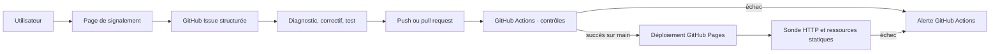

# Bloc 4 - Maintenir l'application en condition opérationnelle

> Dossier de travail - mise à jour du 17 août 2026

## Identification

| Champ | Valeur |
| --- | --- |
| Projet | RoundLab |
| Candidat | À compléter |
| Certification | Expert en Développement Logiciel - RNCP 39583 |
| Bloc | Bloc 4 - Maintenir l'application logicielle en condition opérationnelle |
| Branche de préparation | `codex/bloc-4-criteres-2026-08-17` |
| Version candidate | `0.1.41` dans `web/package.json` |
| Application publique | <https://lakav.github.io/RoundLab/> |

## Avertissement sur les preuves

Ce dossier distingue volontairement :

- les faits vérifiables dans le dépôt ;
- les processus proposés sur cette branche, qui ne seront réellement appliqués
  qu'après validation et fusion ;
- les preuves externes encore à joindre, par exemple une exécution GitHub
  Actions, une issue utilisateur ou une capture de disponibilité.

Une configuration présente dans Git ne prouve pas à elle seule qu'une
surveillance a fonctionné en production. De même, un commit correctif prouve
une modification, mais pas l'existence d'un échange avec un utilisateur.

## 1. Présentation du logiciel maintenu

RoundLab est une application web d'analyse de démos Counter-Strike 2. Elle est
exportée comme site statique et publiée sur GitHub Pages. Les fichiers `.dem`
et `.dem.zst` sont traités localement dans le navigateur par un parseur Rust
compilé en WebAssembly. Les matchs importés sont conservés dans IndexedDB.

Le périmètre de maintenance comprend :

- l'application Next.js et son moteur d'analyse TypeScript dans `web/` ;
- le parseur Rust et son artefact WebAssembly dans `parser/` et
  `web/src/wasm/` ;
- les données statiques de cartes dans `web/public/` ;
- les tests, audits et budgets de performance ;
- la chaîne d'intégration et de déploiement GitHub Actions.

L'architecture statique limite l'exploitation serveur : il n'existe ni API de
production ni base de données distante à superviser. En contrepartie, la
disponibilité de la page, le chargement des ressources JavaScript/WASM et le
fonctionnement du parseur dans le navigateur restent des points critiques.

## 2. Synthèse par compétence

| Compétence | État au 17 août 2026 | Preuves principales | Manque principal |
| --- | --- | --- | --- |
| C4.1.1 - Mises à jour des dépendances | Démontré | lockfiles, audits `pnpm` et `cargo`, PR Dependabot, correction B4-005 de 16 à 0 avis npm | CI distante de la branche |
| C4.1.2 - Supervision et alertes | Implémenté et validé localement | sonde planifiée, manifeste, contrôle WASM, issue automatique | premier run distant après déploiement |
| C4.2.1 - Consignation des anomalies | Démontré par le registre et l'incident B4-005 | page `/feedback`, formulaire GitHub, registre local | première issue utilisateur réelle pour C4.3.3 |
| C4.2.2 - Correctif et déploiement continu | Démontré | commits correctifs, tests, CI, déploiement et rollback distants | CI et déploiement de la version 0.1.41 |
| C4.3.1 - Axes d'amélioration | Démontré et premières priorités réalisées | recommandations chiffrées, supervision et Dependabot | mesures de production à collecter |
| C4.3.2 - Journal des versions | Démontré par les révisions déployées et renforcé | `CHANGELOG.md`, version 0.1.41, historique distant | livraison de 0.1.41 après validation |
| C4.3.3 - Collaboration support/client | Processus prêt, cas réel absent | formulaire, fiche de collaboration, diagnostics | échange réel et validation par un tiers |

## 3. C4.1.1 - Gérer les mises à jour des dépendances

### 3.1 État observable

Les dépendances web sont décrites dans `web/package.json` et verrouillées dans
`web/pnpm-lock.yaml`. Les dépendances Rust sont décrites dans
`parser/Cargo.toml` et verrouillées dans `parser/Cargo.lock`. Les versions
d'outillage structurantes sont également contraintes :

- Node.js 24 ;
- pnpm 11.9.0 ;
- Rust 1.95.0 ;
- `wasm-bindgen-cli` 0.2.126 dans la CI.

À chaque pull request vers `main` et à chaque push sur `main`, la CI :

1. installe les dépendances web avec le lockfile figé ;
2. exécute `pnpm audit --audit-level high` ;
3. installe `cargo-audit` puis exécute `cargo audit` ;
4. lance les tests, le lint, le typage, le build et les audits applicatifs.

Le commit `815fd82` du 30 juillet 2026, intitulé « Met à jour les dépendances
web vulnérables », constitue un exemple de mise à jour corrective. L'historique
du commit ne conserve toutefois ni identifiant de vulnérabilité, ni ticket, ni
résultat d'audit avant/après. Il ne faut donc pas prétendre connaître les CVE
corrigées.

Le contrôle du 3 août 2026 a ensuite trouvé deux avis RustSec de type
`unsound` : `RUSTSEC-2026-0190` dans `anyhow` 1.0.102 et
`RUSTSEC-2026-0186` dans `memmap2` 0.9.10. Aucun appel aux fonctions affectées
n'a été trouvé dans le dépôt, mais des versions corrigées existaient. Le
lockfile a donc été mis à jour vers `anyhow` 1.0.103 et `memmap2` 0.9.11.
`cargo audit` ne remonte plus aucun avis après la mise à jour.

Le 17 août 2026, `pnpm audit` signalait 16 avis, dont 6 élevés. L'incident
`B4-005` consigne les paquets et les seuils corrigés. Des surcharges transitives
ciblées ont été ajoutées dans `web/pnpm-workspace.yaml`, puis le lockfile a été
régénéré. Le contrôle final retourne **0 vulnérabilité connue** ; lint, typage,
400 tests unitaires avec couverture, build statique et audit de l'artefact
passent après la modification.

### 3.2 Processus proposé

Le processus détaillé se trouve dans
[`processus-maintenance.md`](processus-maintenance.md). La politique proposée
est la suivante :

- contrôle de vulnérabilités à chaque PR et push sur `main` ;
- revue manuelle des dépendances une fois par semaine ;
- regroupement mensuel des mises à jour mineures et correctives ;
- traitement immédiat des alertes critiques, sous 24 heures pour la décision
  et sous 72 heures pour le correctif ou la mesure compensatoire ;
- mise à jour majeure isolée dans une branche dédiée, après lecture des notes
  de migration ;
- validation dans l'ordre : installation figée, audit, tests unitaires,
  typage/lint, build, accessibilité, audits applicatifs, puis déploiement.

Cette cadence devient une règle de projet avec ce document, mais son exécution
régulière devra être prouvée par des tickets ou des PR datés.

Dependabot est déjà actif et a ouvert plusieurs pull requests. Il contrôle
chaque lundi les dépendances npm dans `web/` et Cargo dans `parser/`, puis les
actions GitHub chaque mois. Les propositions restent des pull requests : aucune
mise à jour n'est fusionnée automatiquement sans les contrôles du projet.

### 3.3 Preuves à présenter au jury

- extrait de `.github/workflows/_checks.yml` montrant les deux audits ;
- `web/package.json`, `web/pnpm-lock.yaml`, `parser/Cargo.toml` et
  `parser/Cargo.lock` ;
- diff et contrôle CI du commit `815fd82` ;
- diff de `parser/Cargo.lock` et audit Rust sans avis pour B4-004 ;
- PR Dependabot existantes et incident `B4-005` avec audit avant/après.

## 4. C4.1.2 - Concevoir un système de supervision et d'alerte

### 4.1 Dispositif existant

La surveillance actuelle couvre surtout la qualité avant déploiement :

- échec de la CI sur vulnérabilité web de niveau élevé ou supérieur ;
- échec de la CI sur avis de sécurité Rust ;
- lint, typage, tests avec couverture et compilation ;
- tests d'accessibilité navigateur ;
- audit du site statique produit ;
- budget JavaScript de 2 150 000 octets ;
- budget WebAssembly de 3 500 000 octets et contrôle de l'unicité de l'artefact ;
- vérification de reproductibilité du WebAssembly versionné ;
- déploiement uniquement après succès de la CI de `main`.

Dans l'application, la console de diagnostic ouverte avec
`Ctrl/Cmd + Shift + D` expose l'état du parseur et permet de copier les logs du
navigateur. La page `/feedback` prépare une issue GitHub avec le type de
problème, le comportement observé, les étapes, le résultat attendu et le user
agent.

### 4.2 Supervision ajoutée pour la version 0.1.41

La branche ajoute les composants suivants :

- `scripts/write-deployment-manifest.py` publie la version, le commit, le chemin,
  la taille et le SHA-256 du WASM dans `health.json` ;
- `scripts/monitor-production.py` contrôle l'accueil, `/feedback/`, le manifeste
  et l'intégrité complète du WASM ;
- `.github/workflows/monitor-production.yml` exécute cette sonde toutes les six
  heures et à la demande ;
- chaque rapport JSON et Markdown est conservé 90 jours ;
- un échec ouvre une issue d'incident ou complète celle déjà ouverte ;
- un retour à la normale ajoute une preuve puis ferme l'incident ;
- le workflow reste en échec après avoir consigné l'incident, afin de préserver
  l'alerte GitHub Actions.

La sonde applique un avertissement au-delà de 2 secondes et un échec au-delà de
5 secondes. Ces seuils sont des valeurs initiales à réévaluer après une semaine
de mesures.

Le 17 août 2026 avant déploiement de cette branche, l'accueil et `/feedback/`
répondaient en HTTP 200, tandis que `/health.json` répondait en HTTP 404. C'est
normal : le manifeste n'existe en production qu'après fusion et nouveau
déploiement. La supervision n'est donc pas encore présentable comme active tant
qu'un run distant réussi n'a pas été conservé.

Il n'existe toujours pas de centralisation automatique des erreurs navigateur.
Ce choix protège les démos locales, mais impose à l'utilisateur de transmettre
volontairement les diagnostics.

### 4.3 Topologie cible

La sonde est implémentée et testée sur l'export réel : accueil, feedback,
manifeste et intégrité WASM passent localement. Son activation réelle dépend de
la fusion dans `main` et du déploiement du manifeste.

## 5. C4.2.1 - Consigner les anomalies

Le canal public de collecte est la page `/feedback`. Elle conduit vers une
issue GitHub préremplie et demande les informations nécessaires à la
reproduction. La branche ajoute aussi un formulaire natif GitHub dans
`.github/ISSUE_TEMPLATE/bug-report.yml` avec catégorie, impact, version,
navigateur, résultat observé, étapes, résultat attendu, diagnostics et
confirmation de confidentialité. La console de diagnostic complète le
signalement sans téléverser automatiquement une démo potentiellement sensible.

Le registre initial est disponible dans
[`registre-anomalies.md`](registre-anomalies.md). Il reconstruit trois cas à
partir de l'historique Git :

- croissance mémoire pendant le replay ;
- échec d'import des très grandes démos ;
- dépendances web vulnérables.

Pour chaque nouvelle anomalie, la fiche doit contenir au minimum : identifiant,
source, date, environnement, résultat observé, résultat attendu, étapes de
reproduction, sévérité, analyse, correctif, tests, version et statut.

## 6. C4.2.2 - Créer et déployer un correctif

### 6.1 Cas retenu : import d'une grande démo

Le commit `c995760` du 22 juillet 2026 corrige un dépassement de mémoire lors du
traitement de grandes démos dans le navigateur.

Le diagnostic technique visible dans le diff est le suivant : le décodeur Zstd
et le parseur WebAssembly pouvaient conserver simultanément de gros tas mémoire.
De plus, l'échantillonnage complet d'une démo décompressée très volumineuse
pouvait atteindre la limite mémoire 32 bits de WebAssembly.

Le correctif :

1. déplace la décompression Zstd dans un Worker court ;
2. termine ce Worker avant de lancer le parseur afin de libérer son tas ;
3. utilise une stratégie d'échantillonnage sûre à partir de 384 Mio ;
4. transforme les erreurs WebAssembly opaques en message exploitable ;
5. ajoute des tests de seuil et de message d'erreur ;
6. étend l'audit de localité du parseur au nouveau Worker.

Le comportement actuel va plus loin : le mode « précision maximale » est
refusé à partir du seuil de sécurité, tandis que le mode rapide reste autorisé.
Les preuves actuelles sont `web/src/lib/parser-memory.ts`,
`web/src/workers/web-parser.worker.ts` et
`web/tests/parser-memory.test.ts`.

### 6.2 Intégration et déploiement

Le flux prévu est : branche corrective, tests locaux, pull request vers
`main`, CI obligatoire, fusion, puis workflow GitHub Pages déclenché uniquement
si la CI associée à `main` a réussi. Le fichier de déploiement encode bien ce
garde-fou.

Pour le jury, il faut encore joindre les captures ou liens de la PR et des runs
GitHub Actions de la version 0.1.41. Des preuves historiques existent déjà :

- [PR #2 et CI réussie](https://github.com/Lakav/RoundLab/pull/2) ;
- [PR #3 avec déploiement et rollback](https://github.com/Lakav/RoundLab/pull/3) ;
- [PR #5 avec restauration et smoke test](https://github.com/Lakav/RoundLab/pull/5) ;
- [CI de `main` du 3 août 2026](https://github.com/Lakav/RoundLab/actions/runs/30799703961) ;
- [déploiement correspondant](https://github.com/Lakav/RoundLab/actions/runs/30799877146).

L'historique montre également que les déploiements associés aux CI en échec du
27 et du 30 juillet ont été ignorés. Cela prouve que la condition de sécurité du
workflow fonctionne, sans prouver à elle seule l'absence de tout défaut métier.

## 7. C4.3.1 - Proposer des axes d'amélioration

| Priorité | Recommandation | Gain attendu | Coût estimé | Indicateur de succès |
| --- | --- | --- | --- | --- |
| Réalisé sur la branche | Ajouter une sonde de disponibilité planifiée | détecter une page ou un artefact indisponible sans attendre un utilisateur | 0,5 à 1 jour | taux de succès et délai de détection |
| Réalisé sur la branche | Automatiser les propositions de mise à jour | réduire le délai d'exposition aux vulnérabilités | 0,5 jour puis 30 min/semaine | âge médian des dépendances et délai de correction |
| Réalisé sur la branche | Tenir un changelog à chaque fusion livrable | rendre les correctifs et versions auditables | 15 min par livraison | 100 % des versions documentées |
| P2 | Ajouter un modèle d'issue avec sévérité et version | accélérer la reproduction et le triage | 0,5 jour | part des tickets reproductibles au premier échange |
| P2 | Ajouter un test navigateur de fumée sur le site déployé | vérifier plus que le simple code HTTP | 1 à 2 jours | taux de parcours réussi |
| P3 | Proposer un rapport d'erreur opt-in respectueux des données | mieux observer les erreurs navigateur | 2 à 4 jours | erreurs groupées par version sans fichier `.dem` envoyé |

Les trois priorités P1 sont réalistes et peu coûteuses. Une plateforme complète
d'observabilité serait disproportionnée à ce stade pour un site statique en
bêta. La collecte automatique de démos serait également une mauvaise idée sans
consentement et politique de conservation explicites.

## 8. C4.3.2 - Établir un journal des versions

La branche prépare la version `0.1.41` et ajoute `CHANGELOG.md`. La version
`0.1.40` peut être reliée au commit `de30fd8` et aux PR distantes #2, #3 et #5,
mais aucun tag final n'avait été créé. La PR #11 indique en outre que les anciens
tags et releases ont été supprimés du dépôt distant pendant le nettoyage.

Le [`journal-versions.md`](journal-versions.md) et le `CHANGELOG.md` racine
initialisent un journal à partir de faits vérifiables. Les prochaines livraisons
devront associer :

- un numéro de version unique ;
- une date ;
- un commit ou tag ;
- les fonctionnalités, corrections et changements de sécurité ;
- les migrations ou limites connues ;
- le résultat de la CI et du contrôle post-déploiement.

## 9. C4.3.3 - Collaborer avec le support et le client

RoundLab fournit des outils utiles à une collaboration : formulaire de bug,
issue GitHub préremplie, console de diagnostic, messages d'erreur actionnables
et historique de correctifs.

En revanche, le dépôt ne contient pas de preuve suffisante d'une collaboration
réelle avec une équipe support ou un client. Pour satisfaire ce critère sans
inventer, il faut annexer un cas réel montrant :

1. la demande initiale ou le problème remonté ;
2. les questions de clarification ;
3. le diagnostic partagé en termes compréhensibles ;
4. la contribution de chaque partie ;
5. la confirmation que le correctif répond au besoin.

Si aucun client ni support n'a participé, il faut le dire au jury. Une issue
créée uniquement par le développeur ne prouve pas cette collaboration.

La fiche [`fiche-collaboration-support.md`](fiche-collaboration-support.md)
prépare la collecte de cette preuve. Au 17 août 2026, l'API GitHub ne retourne
aucune issue dans le dépôt et les pull requests existantes ne contiennent aucune
revue externe. Le critère reste donc humainement non couvert malgré l'outillage.

## 10. Annexes à produire

- [ ] identité du candidat et contexte de réalisation ;
- [x] résultat d'audit avant/après consigné dans B4-005 ;
- [x] liens de matrices CI réussies historiques ;
- [x] liens de déploiement et rollback historiques ;
- [ ] résultats de plusieurs exécutions d'une future sonde de production ;
- [ ] issue d'anomalie réelle avec échanges ;
- [ ] PR du correctif et tests associés ;
- [ ] capture du formulaire `/feedback` ;
- [ ] capture de la console de diagnostic ;
- [ ] premier numéro de version ou tag appliqué selon le nouveau journal.

## 11. Références techniques

- `.github/workflows/ci.yml` - déclenchement de l'intégration continue ;
- `.github/workflows/_checks.yml` - contrôles web, Rust, sécurité et qualité ;
- `.github/workflows/deploy-pages.yml` - déploiement conditionné au succès ;
- `scripts/audit-security-baseline.py` - invariants de sécurité applicatifs ;
- `scripts/check-performance-budgets.py` - budgets des artefacts ;
- `scripts/run-local-ci-checks.py` - reproduction locale des contrôles ;
- `scripts/write-deployment-manifest.py` - identité du déploiement et WASM ;
- `scripts/monitor-production.py` - sonde de production et rapport ;
- `.github/workflows/monitor-production.yml` - planification et alertes ;
- `.github/dependabot.yml` - veille hebdomadaire des dépendances ;
- `.github/ISSUE_TEMPLATE/bug-report.yml` - collecte structurée ;
- `CHANGELOG.md` - journal livrable des versions ;
- `web/src/app/feedback/page.tsx` - collecte structurée des anomalies ;
- `web/src/components/DebugConsole.tsx` - diagnostic navigateur ;
- `web/src/lib/parser-memory.ts` - stratégie mémoire du parseur ;
- `web/tests/parser-memory.test.ts` - non-régression du correctif.
