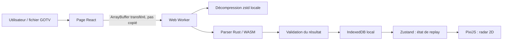

# Architecture et frontières de confiance

## Invariants

- Aucun endpoint applicatif, route API, middleware serveur ou action serveur.
- Aucun `fetch`, `XMLHttpRequest`, `sendBeacon`, `WebSocket` ou `EventSource` sur le chemin d’import.
- La démo entre dans un Worker sous forme d’`ArrayBuffer` transféré.
- Décompression, parsing WASM, validation et écriture IndexedDB ont lieu dans le navigateur.
- Le Worker renvoie uniquement l’identifiant local stocké, jamais la démo ni le match complet.
- Les métadonnées légères et les payloads de rounds sont séparés dans IndexedDB ; un round est chargé à la demande.
- L’export Next.js est statique (`output: "export"`).

Ces invariants sont contrôlés par `audit-browser-parser-locality.py`, `audit-static-web-export.py`, `audit-browser-store-contract.py` et les tests Vitest IndexedDB/Worker.

## Choix d’évolutivité

- `RoundLabBackend` découple l’UI des services parser, stockage, diagnostic et plein écran.
- Zustand porte une machine d’état de replay testable indépendamment de PixiJS.
- Le Web Worker évite de bloquer le thread d’interface pendant le parsing.
- Les rounds séparés évitent de relire un match complet pour chaque navigation.
- Rust/WASM conserve un unique cœur de parsing typé et local.

## Frontières de confiance

Le fichier GOTV est non fiable. Les protections sont : filtre d’extension côté UI et backend, limite de 1 Gio avant lecture, limite de 1 Gio après décompression, parser isolé dans un Worker, validation des rounds avant stockage, validation des clés/payloads à la lecture IndexedDB et absence d’interprétation HTML du contenu de la démo.
